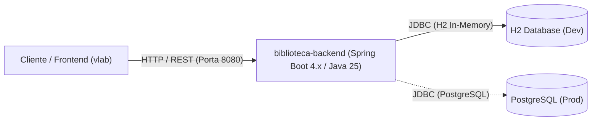

# Runbook Operacional: Biblioteca Backend API 📚⚙️

Este documento é o Manual Operacional (Runbook / SOP) do microsserviço **Biblioteca Backend API**. Ele descreve procedimentos operacionais padrão, arquitetura em tempo de execução, rotinas de inicialização, manutenção, monitoramento e resposta a incidentes.

---

## 1. Ficha Técnica e Arquitetura do Serviço

| Atributo | Detalhes |
| :--- | :--- |
| **Nome do Serviço** | `biblioteca-backend` |
| **Tecnologias** | Java 25 (LTS), Spring Boot 4.1.1, Spring Data JPA / Hibernate |
| **Persistência Padrão** | H2 Database em memória (`jdbc:h2:mem:testdb`) |
| **Persistência Produção** | PostgreSQL (suporte via variáveis de ambiente) |
| **Porta Padrão** | `8080` (HTTP) |
| **Endpoints Principais** | `GET /livros`, `POST /livros`, `DELETE /livros/{id}`, `GET /h2-console` |
| **Artefato de Saída** | `target/biblioteca-0.0.1-SNAPSHOT.jar` |
| **Imagem Docker** | `biblioteca-backend:latest` (base: `eclipse-temurin:25-jre-alpine`) |
| **Consumidores Diretos** | Frontend Web `vlab` (Porta `3000` / `5173`) |

### Diagrama de Dependências


---

## 2. Variáveis de Ambiente & Configuração

As seguintes variáveis controlam a execução do serviço sem necessidade de recompilação:

| Variável | Padrão (Dev) | Descrição / Exemplo Produção |
| :--- | :--- | :--- |
| `JAVA_HOME` | `C:\Users\nando\.jdk\jdk-25\jdk-25.0.2` | Caminho absoluto do JDK 25 |
| `SERVER_PORT` | `8080` | Porta onde a aplicação escutará |
| `SPRING_DATASOURCE_URL` | `jdbc:h2:mem:testdb;DB_CLOSE_DELAY=-1` | `jdbc:postgresql://localhost:5432/biblioteca_db` |
| `SPRING_DATASOURCE_USERNAME` | `sa` | Usuário do banco de dados (ex: `postgres`) |
| `SPRING_DATASOURCE_PASSWORD` | *(vazio)* | Senha do banco de dados |
| `SPRING_JPA_HIBERNATE_DDL_AUTO` | `update` | Em produção utilizar `validate` ou `none` |
| `SPRING_H2_CONSOLE_ENABLED` | `true` | Em produção definir como `false` |

---

## 3. Procedimentos Operacionais Padrão (SOP)

### SOP-01: Inicialização em Modo Desenvolvimento Local

> [!IMPORTANT]
> O Spring Boot e o `pom.xml` exigem o JDK 25. Antes de executar qualquer comando Maven, garanta o `JAVA_HOME` configurado.

#### No Windows PowerShell:
```powershell
# 1. Definir JAVA_HOME na sessão
$env:JAVA_HOME = "C:\Users\nando\.jdk\jdk-25\jdk-25.0.2"
$env:Path = "$env:JAVA_HOME\bin;" + $env:Path

# 2. Navegar até a pasta do projeto
cd C:\Users\nando\GitHub\biblioteca-backend

# 3. Iniciar com Maven Wrapper
.\mvnw.cmd spring-boot:run
```

#### No Linux / macOS:
```bash
export JAVA_HOME=/caminho/para/jdk-25
export PATH=$JAVA_HOME/bin:$PATH
cd biblioteca-backend
./mvnw spring-boot:run
```

---

### SOP-02: Build e Empacotamento de Release (JAR)

Gera o pacote executável com testes validados:

```powershell
# Execução completa com testes:
.\mvnw.cmd clean package

# Build rápido pulando testes (quando já validados no CI):
.\mvnw.cmd clean package -DskipTests
```
O artefato final estará em `target/biblioteca-0.0.1-SNAPSHOT.jar`.

---

### SOP-03: Execução do JAR como Processo Standalone

#### Execução direta com parâmetros de memória recomendados:
```powershell
java -Xms256m -Xmx512m -jar target\biblioteca-0.0.1-SNAPSHOT.jar
```

#### Execução apontando para banco PostgreSQL externo:
```powershell
$env:SPRING_DATASOURCE_URL = "jdbc:postgresql://db-host:5432/biblioteca_db"
$env:SPRING_DATASOURCE_USERNAME = "app_user"
$env:SPRING_DATASOURCE_PASSWORD = "app_password"
$env:SPRING_JPA_HIBERNATE_DDL_AUTO = "validate"
$env:SPRING_H2_CONSOLE_ENABLED = "false"

java -Xms256m -Xmx512m -jar target\biblioteca-0.0.1-SNAPSHOT.jar
```

---

### SOP-04: Gestão do Serviço em Segundo Plano (Background / PM2)

Caso a aplicação precise rodar continuamente em servidores sem Docker:

```powershell
# Iniciar gerenciado pelo PM2
pm2 start "java -Xms256m -Xmx512m -jar target/biblioteca-0.0.1-SNAPSHOT.jar" --name "biblioteca-backend"

# Checar saúde e recursos
pm2 status biblioteca-backend

# Visualizar logs em tempo real
pm2 logs biblioteca-backend

# Reiniciar
pm2 restart biblioteca-backend

# Parar
pm2 stop biblioteca-backend
```

---

### SOP-05: Operação com Docker

#### 1. Construção da imagem:
```bash
docker build -t biblioteca-backend:latest .
```

#### 2. Executar container com H2 em memória:
```bash
docker run -d \
  -p 8080:8080 \
  --name biblioteca-backend \
  --restart unless-stopped \
  --memory="512m" \
  biblioteca-backend:latest
```

#### 3. Executar container conectado a PostgreSQL externo:
```bash
docker run -d \
  -p 8080:8080 \
  --name biblioteca-backend \
  --restart unless-stopped \
  --memory="512m" \
  -e SPRING_DATASOURCE_URL="jdbc:postgresql://host.docker.internal:5432/biblioteca_db" \
  -e SPRING_DATASOURCE_USERNAME="postgres" \
  -e SPRING_DATASOURCE_PASSWORD="sua_senha_segura" \
  -e SPRING_JPA_HIBERNATE_DDL_AUTO="validate" \
  -e SPRING_H2_CONSOLE_ENABLED="false" \
  biblioteca-backend:latest
```

---

## 4. Verificação de Saúde (Health Check) & Testes de Sanidade

Após iniciar a aplicação, execute os seguintes testes para validar a integridade operacional:

### 1. Teste de Listagem (Smoke Test)
```powershell
Invoke-RestMethod -Uri "http://localhost:8080/livros" -Method Get
```
*Resultado Esperado:* Código HTTP `200 OK` com array JSON `[]` ou lista de livros cadastrados.

### 2. Teste de Criação de Livro
```powershell
$body = @{
    titulo = "Engenharia de Confiabilidade do Google (SRE)"
    autor = "Betsy Beyer et al."
    genero = "Tecnologia"
    anoPublicacao = 2016
    descricao = "Como o Google executa sistemas de produção"
} | ConvertTo-Json

Invoke-RestMethod -Uri "http://localhost:8080/livros" -Method Post -Body $body -ContentType "application/json; charset=utf-8"
```
*Resultado Esperado:* Código HTTP `201 Created` retornando o objeto criado com `id` gerado.

### 3. Teste de Deleção
```powershell
Invoke-RestMethod -Uri "http://localhost:8080/livros/1" -Method Delete
```
*Resultado Esperado:* Código HTTP `204 No Content`.

---

## 5. Matriz de Resolução de Incidentes (Troubleshooting)

### Incidente 1: `Port 8080 is already in use`
- **Sintoma:** O Spring Boot aborta na inicialização informando que a porta 8080 já está ocupada.
- **Ação de Diagnóstico:**
  ```powershell
  # Identificar o PID ocupando a porta 8080
  Get-NetTCPConnection -LocalPort 8080 -ErrorAction SilentlyContinue | Select-Object LocalAddress, LocalPort, OwningProcess
  ```
- **Ação Corretiva:**
  ```powershell
  # Encerrar o processo pelo PID (substitua <PID> pelo número retornado)
  Stop-Process -Id <PID> -Force
  ```
  *Alternativa:* Iniciar o backend em outra porta passando `-Dserver.port=8081` ou `$env:SERVER_PORT=8081`.

---

### Incidente 2: `java.lang.UnsupportedClassVersionError` ou Falha no Maven por versão do JDK
- **Sintoma:** Erro indicando que a classe foi compilada por uma versão mais recente do Java Runtime ou incompatibilidade de target version 25.
- **Causa Raiz:** O terminal está utilizando um JDK inferior ao Java 25 (ex: Java 17 ou 21).
- **Ação Corretiva:**
  ```powershell
  $env:JAVA_HOME = "C:\Users\nando\.jdk\jdk-25\jdk-25.0.2"
  $env:Path = "$env:JAVA_HOME\bin;" + $env:Path
  java -version
  # Deve exibir: openjdk version "25" ou "25.0.2"
  ```

---

### Incidente 3: Falha de Conexão com Banco de Dados em Produção (`Connection refused`)
- **Sintoma:** Erro `org.postgresql.util.PSQLException: Connection refused` na inicialização.
- **Ações de Diagnóstico:**
  1. Testar conectividade de rede com a porta do banco:
     ```powershell
     Test-NetConnection -ComputerName "localhost" -Port 5432
     ```
  2. No Docker, certifique-se de que o host está acessível via `host.docker.internal` e que a porta `5432` está aberta na máquina hospedeira.
  3. Validar se as credenciais informadas nas variáveis `SPRING_DATASOURCE_USERNAME` e `SPRING_DATASOURCE_PASSWORD` estão corretas.

---

### Incidente 4: Esgotamento de Memória (`java.lang.OutOfMemoryError: Java heap space`)
- **Sintoma:** A aplicação congela ou é encerrada inesperadamente pelo OOM Killer do SO ou Docker.
- **Ação Corretiva:**
  - Ajustar os limites de Heap no comando de inicialização ou no Docker:
    ```bash
    # Para o JAR:
    java -XX:+UseG1GC -Xms512m -Xmx1024m -jar target/biblioteca-0.0.1-SNAPSHOT.jar
    
    # Para o container Docker:
    docker run -m 1g --memory-swap 1g ...
    ```

---

### Incidente 5: Erro de Validação de Dados (`400 Bad Request`)
- **Sintoma:** O cliente envia `POST /livros` e recebe `400 Bad Request`.
- **Causa:** Campos obrigatórios ausentes ou inválidos.
- **Regras de Negócio Implementadas:**
  - `titulo`: Obrigatório (`@NotBlank`)
  - `autor`: Obrigatório (`@NotBlank`)
  - `genero`: Obrigatório (`@NotBlank`)
  - `anoPublicacao`: Obrigatório (`@NotNull`)

---

## 6. Procedimento de Parada e Rollback de Emergência

### Parada Imediata de Processo Local:
```powershell
# Encerrar processos Java do usuário
Get-Process -Name "java" | Stop-Process -Force
```

### Parada e Remoção do Container Docker:
```bash
docker stop biblioteca-backend
docker rm biblioteca-backend
```

### Rollback de Versão:
1. Pare a versão atual com falha:
   ```bash
   docker stop biblioteca-backend && docker rm biblioteca-backend
   ```
2. Inicie a tag anterior estável (ex: `v1.0.0`):
   ```bash
   docker run -d -p 8080:8080 --name biblioteca-backend biblioteca-backend:v1.0.0
   ```
