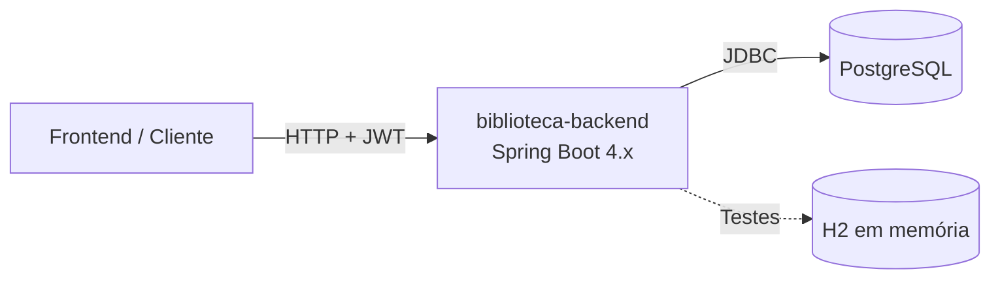

# Runbook Operacional: Biblioteca Backend API 📚⚙️

Este documento descreve os procedimentos operacionais do serviço **Biblioteca Backend API**, incluindo inicialização, manutenção, monitoramento, segurança, troubleshooting e recuperação de falhas.

---

## 1. Ficha técnica do serviço

| Atributo | Detalhes |
| :--- | :--- |
| **Nome** | `biblioteca-backend` |
| **Tecnologias** | Java 21, Spring Boot 4.1.1, Spring Security, Spring Data JPA / Hibernate |
| **Banco padrão** | PostgreSQL (`jdbc:postgresql://localhost:5432/biblioteca`) |
| **Perfil de teste** | H2 em memória (`application-test.properties`) |
| **Porta padrão** | `8080` |
| **Autenticação** | JWT com roles `ADMIN` e `PADRAO` |
| **Artefato de build** | `target/biblioteca-0.0.1-SNAPSHOT.jar` |
| **Imagens Docker** | `Dockerfile` e `Dockerfile.backend` |
| **Frontend consumidor** | aplicação local em `http://localhost:5173` |

### Diagrama de dependências



---

## 2. Configuração e variáveis de ambiente

Os valores abaixo refletem a configuração atual em `src/main/resources/application.yaml`.

| Variável | Valor padrão | Observação |
| :--- | :--- | :--- |
| `JAVA_HOME` | `C:\Users\nando\.jdk\jdk-25\jdk-25.0.2` | Use JDK 21+; compatível com 25 |
| `SERVER_PORT` | `8080` | Porta HTTP do Spring Boot |
| `SPRING_DATASOURCE_URL` | `jdbc:postgresql://localhost:5432/biblioteca` | Banco padrão da aplicação |
| `SPRING_DATASOURCE_USERNAME` | `postgres` | Usuário do banco |
| `SPRING_DATASOURCE_PASSWORD` | `postgres` | Senha padrão local |
| `SPRING_JPA_HIBERNATE_DDL_AUTO` | `update` | Ajustar conforme ambiente |
| `JWT_SECRET` | `FEÇD58D4531F5827E82374S5WD51Ç72D` | Chave de assinatura JWT |
| `WEB_ORIGENS_PERMITIDAS` | `http://localhost:5173` | CORS local |
| `WEB_METODOS_PERMITIDOS` | `*` | Métodos permitidos |
| `WEB_CREDENCIAIS_PERMITIDAS` | `true` | Permite credenciais no CORS |

> O H2 console não está habilitado por padrão em `application.yaml`; ele é usado para os testes via `application-test.properties`.

---

## 3. Procedimentos operacionais padrão (SOP)

### SOP-01: Inicialização em desenvolvimento local

```powershell
# Definir JAVA_HOME
$env:JAVA_HOME = "C:\Users\nando\.jdk\jdk-25\jdk-25.0.2"
$env:Path = "$env:JAVA_HOME\bin;" + $env:Path

# Entrar na pasta do projeto
cd C:\Users\nando\GitHub\biblioteca-backend

# Iniciar aplicação
.\mvnw.cmd spring-boot:run
```

Em Linux / macOS:

```bash
export JAVA_HOME=/caminho/para/jdk-21-ou-25
export PATH=$JAVA_HOME/bin:$PATH
cd biblioteca-backend
./mvnw spring-boot:run
```

---

### SOP-02: Build e empacotamento da aplicação

```powershell
.\mvnw.cmd clean package
```

Build rápido sem testes:

```powershell
.\mvnw.cmd clean package -DskipTests
```

Artefato gerado:

```text
target\biblioteca-0.0.1-SNAPSHOT.jar
```

---

### SOP-03: Execução direta do JAR

```powershell
java -Xms256m -Xmx512m -jar target\biblioteca-0.0.1-SNAPSHOT.jar
```

Com PostgreSQL externo:

```powershell
$env:SPRING_DATASOURCE_URL = "jdbc:postgresql://db-host:5432/biblioteca"
$env:SPRING_DATASOURCE_USERNAME = "postgres"
$env:SPRING_DATASOURCE_PASSWORD = "senha_segura"
$env:JWT_SECRET = "chave_jwt_segura"

java -Xms256m -Xmx512m -jar target\biblioteca-0.0.1-SNAPSHOT.jar
```

---

### SOP-04: Execução em segundo plano com PM2

```powershell
npm install -g pm2
pm2 start "java -Xms256m -Xmx512m -jar target\biblioteca-0.0.1-SNAPSHOT.jar" --name "biblioteca-backend"
```

Comandos úteis:

```powershell
pm2 status biblioteca-backend
pm2 logs biblioteca-backend
pm2 restart biblioteca-backend
pm2 stop biblioteca-backend
```

---

### SOP-05: Operação com Docker

#### 1. Construção da imagem

```bash
docker build -t biblioteca-backend .
```

#### 2. Execução do container

```bash
docker run -d -p 8080:8080 --name biblioteca-backend biblioteca-backend
```

#### 3. Conexão com PostgreSQL externo

```bash
docker run -d -p 8080:8080 --name biblioteca-backend \
  -e SPRING_DATASOURCE_URL="jdbc:postgresql://host.docker.internal:5432/biblioteca" \
  -e SPRING_DATASOURCE_USERNAME="postgres" \
  -e SPRING_DATASOURCE_PASSWORD="postgres" \
  -e JWT_SECRET="sua_chave_segura" \
  biblioteca-backend
```

---

## 4. Verificação de saúde e testes de sanidade

### 1. Teste de autenticação

```powershell
$body = @{
  email = "maria@biblioteca.com"
  senha = "123456"
} | ConvertTo-Json

Invoke-RestMethod -Uri "http://localhost:8080/auth/login" -Method Post -Body $body -ContentType "application/json; charset=utf-8"
```

Resultado esperado: status HTTP `200 OK` com token JWT no corpo da resposta.

### 2. Teste de listagem de livros

```powershell
Invoke-RestMethod -Uri "http://localhost:8080/livros" -Method Get
```

Resultado esperado: `200 OK` com lista JSON.

### 3. Teste de criação de livro

```powershell
$body = @{
  titulo = "SRE"
  autor = "Betsy Beyer"
  genero = "Tecnologia"
  anoPublicacao = 2016
  descricao = "Livro sobre confiabilidade de sistemas"
} | ConvertTo-Json

Invoke-RestMethod -Uri "http://localhost:8080/livros" -Method Post -Body $body -ContentType "application/json; charset=utf-8"
```

Resultado esperado: `201 Created` com o livro salvo.

### 4. Teste de autorização

Use um usuário com perfil `PADRAO` para verificar que `GET /livros` funciona, mas `POST /livros` retorna `403 Forbidden`.

---

## 5. Segurança e autorização

### Perfis permitidos

- `ADMIN`
- `PADRAO`

### Regras aplicadas

- `/auth/**` → público
- `GET /livros/**` → `ADMIN` ou `PADRAO`
- `POST`, `PUT`, `PATCH`, `DELETE /livros/**` → somente `ADMIN`
- qualquer outra rota → autenticada

### Revisão operacional

- Rotacionar `JWT_SECRET` em ambientes reais
- Não expor chaves em repositórios públicos
- Garantir `https` em produção e CORS adequado
- Usar banco de dados com credenciais fortes e separadas por ambiente

---

## 6. Matriz de troubleshooting

### Incidente 1: porta `8080` em uso

**Sintoma:** aplicação não sobe ou falha com `address already in use`.

**Diagnóstico:**

```powershell
Get-NetTCPConnection -LocalPort 8080 -ErrorAction SilentlyContinue | Select-Object LocalAddress, LocalPort, OwningProcess
```

**Correção:**

```powershell
Stop-Process -Id <PID> -Force
```

Alternativa: usar outra porta via `-Dserver.port=8081`.

---

### Incidente 2: erro de versão do JDK

**Sintoma:** `UnsupportedClassVersionError` ou `JAVA_HOME` não encontrado.

**Correção:**

```powershell
$env:JAVA_HOME = "C:\Users\nando\.jdk\jdk-25\jdk-25.0.2"
$env:Path = "$env:JAVA_HOME\bin;" + $env:Path
java -version
```

Se o projeto usar Java 21 no `pom.xml`, JDK 21 ou superior é requisito mínimo; JDK 25 também funciona.

---

### Incidente 3: falha de conexão com PostgreSQL

**Sintoma:** `Connection refused` ou erro de autenticação.

**Diagnóstico:**

```powershell
Test-NetConnection -ComputerName "localhost" -Port 5432
```

**Ações corretivas:**

- validar `SPRING_DATASOURCE_URL`
- validar usuário e senha do banco
- confirmar que o serviço PostgreSQL está em execução
- em Docker, verificar `host.docker.internal` ou rede apropriada

---

### Incidente 4: `401 Unauthorized` ou `403 Forbidden`

**Causa provável:** token JWT ausente, expirado ou sem as roles corretas.

**Ação:**

1. rever a chamada de login
2. validar o token no header `Authorization: Bearer <token>`
3. confirmar o perfil do usuário (`ADMIN` ou `PADRAO`)

---

### Incidente 5: `400 Bad Request` ao criar livro

**Causa provável:** campos obrigatórios inexistentes ou inválidos.

**Campos importantes:**

```json
{
  "titulo": "string obrigatória",
  "autor": "string obrigatória",
  "genero": "string obrigatória",
  "anoPublicacao": 1954,
  "descricao": "opcional"
}
```

---

## 7. Procedimentos de rollback e continuidade de serviço

### Rollback de versão

1. identificar a última build estável
2. manter o JAR anterior em um diretório de releases
3. parar a instância atual
4. substituir o artefato pela versão anterior
5. reiniciar a aplicação e validar login e listagem de livros

### Continuidade operacional

- manter `JAVA_HOME` configurado no ambiente do serviço
- manter `JWT_SECRET` e credenciais de banco em segurança
- monitorar logs do Spring Boot e do container Docker
- manter backups do banco PostgreSQL antes de migrações ou mudanças drásticas

---

## 8. Comandos úteis de apoio

```powershell
# Verificar processos Java
Get-Process -Name "java"

# Ver logs do Spring Boot
Get-Content .\logs\app.log -Wait

# Validar conexão com banco
psql -h localhost -U postgres -d biblioteca
```

---

## 9. Referências internas

- [README.md](./README.md)
- [pom.xml](./pom.xml)
- [src/main/resources/application.yaml](./src/main/resources/application.yaml)
- [src/test/resources/application-test.properties](./src/test/resources/application-test.properties)

- **Regras de Negócio Implementadas:**
  - `titulo`: Obrigatório (`@NotBlank`)
  - `autor`: Obrigatório (`@NotBlank`)
  - `genero`: Obrigatório (`@NotBlank`)
  - `anoPublicacao`: Obrigatório (`@NotNull`)

---

## 6. Procedimento de Parada e Rollback de Emergência

### Parada Imediata de Processo Local:
```powershell
# Encerrar processos Java do usuário
Get-Process -Name "java" | Stop-Process -Force
```

### Parada e Remoção do Container Docker:
```bash
docker stop biblioteca-backend
docker rm biblioteca-backend
```

### Rollback de Versão:
1. Pare a versão atual com falha:
   ```bash
   docker stop biblioteca-backend && docker rm biblioteca-backend
   ```
2. Inicie a tag anterior estável (ex: `v1.0.0`):
   ```bash
   docker run -d -p 8080:8080 --name biblioteca-backend biblioteca-backend:v1.0.0
   ```
